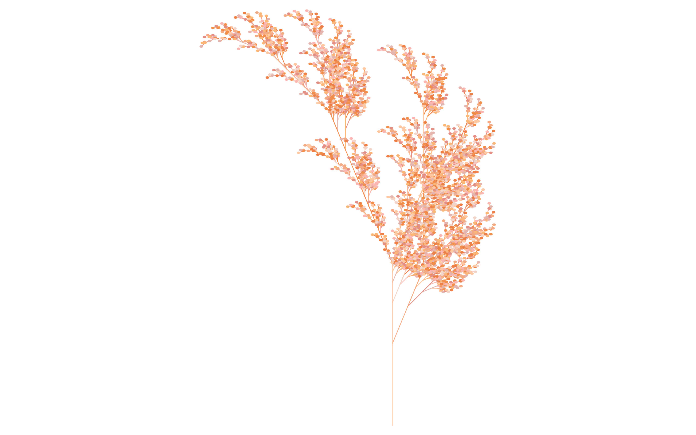
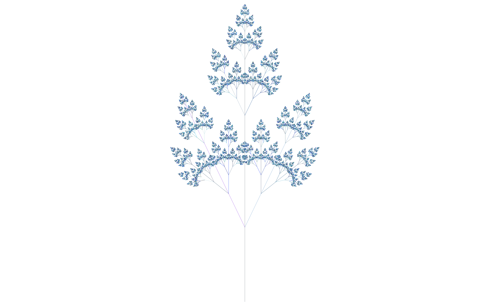
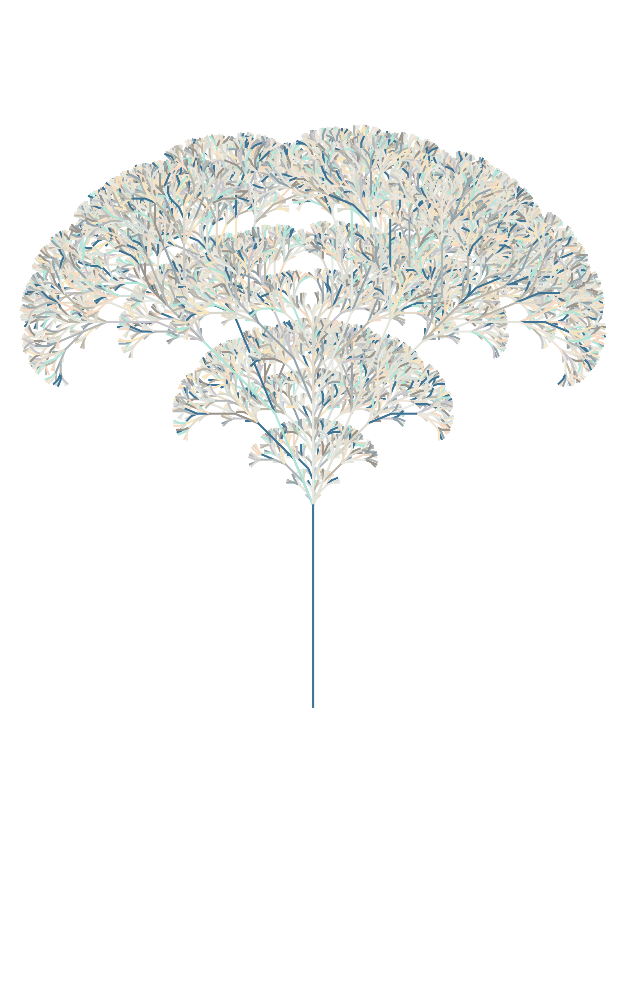
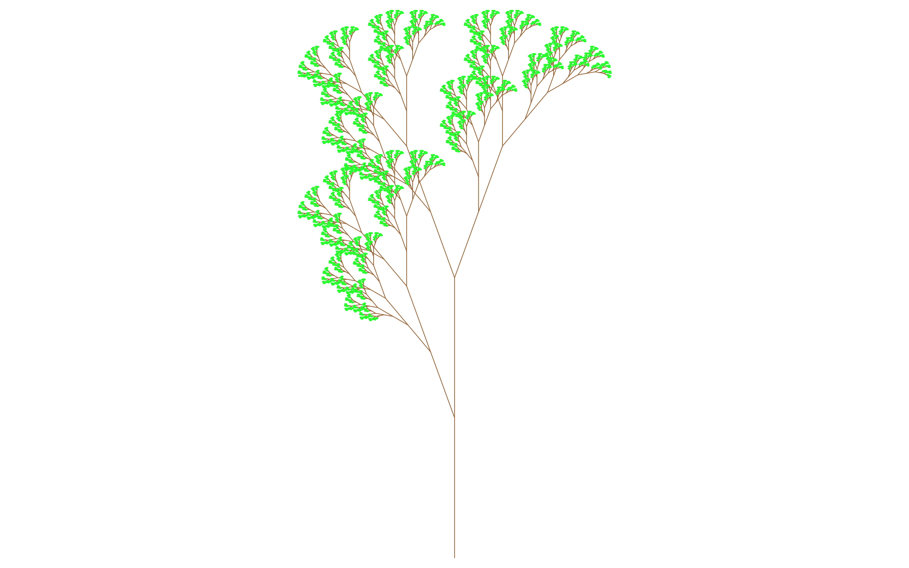
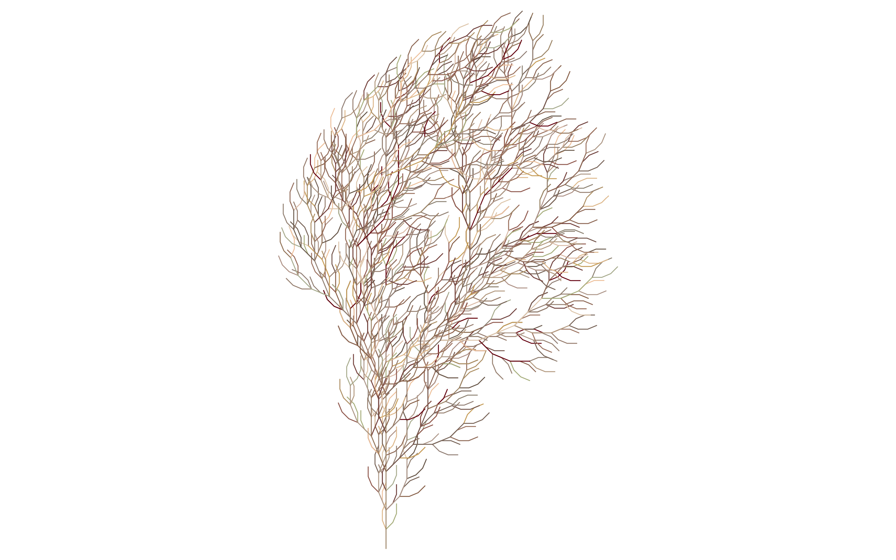
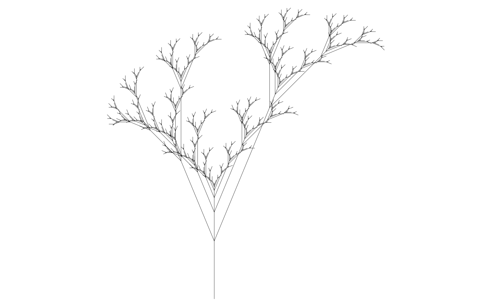

# L-System Fractals

## The code used to generate the images of this repository is available in the [Wolfram Function Repository - LSystem function](https://resources.wolframcloud.com/FunctionRepository/resources/LSystem/).

This repository contains a set of PDF files with images of fractals and plant skeletonn generated using the [Lindenmayer System (L-System)](https://en.wikipedia.org/wiki/L-system). In total, there are **150** files. To implement it I used the [Wolfram Language](https://www.wolfram.com/language/)). I used one of my functions to pick the set of colors for some of the images: [ColorSearch](https://resources.wolframcloud.com/FunctionRepository/resources/ColorSearch?i=ColorSearch&searchapi=https%3A%2F%2Fresources.wolframcloud.com%2FFunctionRepository%2Fsearch). I hope you can delight yourself with this beautiful and satisfying images the same way I did when I was creating them.

Feel free to share and use the files and if possible make reference to this repo or for my [LinkedIn profile](https://www.linkedin.com/in/renan-germano/). 🙂

Following, some examples of what you can find here:

